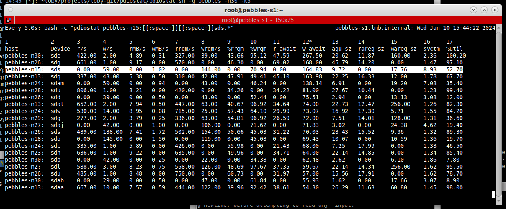

# pdiostat
Run iostat on the servers of a clustered filesystem using pdsh, sort results, show busiest disks

## Prerequisites
pdsh must be setup up with ssh keys for all servers that are
part of your clustered filesystem. If your hosts are in
group ''ceph'', the following should return their hostnames:

```
# pdsh -g ceph hostname
```

It needs a reasonably modern version of iostat on both the cluster
hosts and the host you run pdiostat on.
```
# iostat -V
sysstat version 10.1.5
```


## Usage
```
pdiostat.sh [-g group] [-n num_lines] [-k sort_field] [-s search_string]
  group        : pdsh group defined in .dsh/group/
  num_lines    : number of lines to display
  sort_field   : integer 3-15, sorting iostat output, default: #15 %util 
  search_string: string to highlight, eg "ceph1:.*"
```
Eg: To monitor the pebbles cluster, sorting on w_await, highlighting /dev/sds activity on pebbles-n15:
```
pdiostat -g pebbles -k 12 -s "pebbles-n15:  sds.*"
```



## License

This project is licensed under the GPL v2 License - see the [LICENSE](LICENSE) file for details
